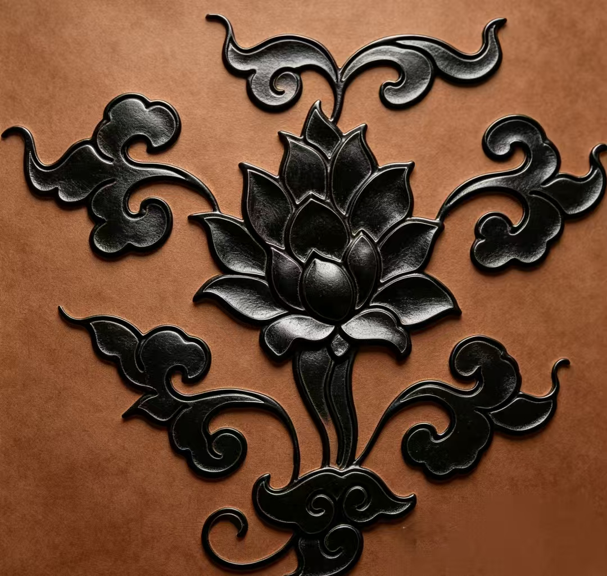

<section class="library-head">
  
CO-CREATION COMMUNITY

  <h2>共创社区</h2>
  
在这里，每一份创意都被看见，每一段文化感悟都值得分享。

</section>

  <button class="community-tab is-active" data-panel="panel-feed">
    💬 艺境动态
  </button>
  <button class="community-tab" data-panel="panel-dao">
    🗳 DAO 治理
  </button>

<!-- 艺境动态 Panel -->

  

    <!-- Left sidebar -->
    <aside class="community-side-left">
      

        
🛡

        <strong class="community-card-title">社区规范</strong>
        
Respect &amp; Create

        <ul class="community-rules-list">
          <li>尊重原创，分享真实的文化感悟。</li>
          <li>禁止发布任何形式的广告信息。</li>
          <li>友善沟通，共同维护艺术交流环境。</li>
        </ul>
      

      

        
✦

        <strong>创世创作者计划</strong>
        
分享优质文化动态，赢取限量版数字藏品空投。

        <a class="btn-solid creator-plan-btn" href="#">立即报名</a>
      

    </aside>

    <!-- Center feed -->
    

      

        

        <input class="community-compose-input" type="text" placeholder="在此分享你的文化感悟与创意..." readonly />
        

          🖼
          😊
          📍
          <button class="community-compose-ai">✦ AI 润色</button>
          <button class="community-compose-send">发布 ➤</button>
        

      

      <article class="community-post">
        

          

          

            <strong>林深见鹿</strong>
            高级收藏家
            2小时前
          

          <button class="community-post__more">···</button>
        

        
今日偶得一尊宋代青瓷瓶，其天青色釉面如雨过天晴，开片纹理自然生动，深感古人造物之精妙。#宋代美学 #青瓷 #艺术收藏

        

          #宋代美学
          #青瓷
          #艺术收藏
        

        

          
        

        

          👍 128
          💬 34
          ↗ 分享
        

      </article>

      <article class="community-post">
        

          

          

            <strong>墨染青衣</strong>
            资深研究者
            5小时前
          

          <button class="community-post__more">···</button>
        

        
元代青花瓷的蓝色发色来自进口的苏麻离青料，铁钴共存使其呈现独特的浓艳蓝黑。国产青料则更偏灰蓝，两者之别可从笔触晕散处细辨。#元青花 #陶瓷工艺

        

          #元青花
          #陶瓷工艺
        

        

          👍 96
          💬 21
          ↗ 分享
        

      </article>

      <article class="community-post">
        

          

          

            <strong>书法传人</strong>
            昨天
          

          <button class="community-post__more">···</button>
        

        
清代粉彩以玻璃白打底，再于其上渲染彩料，因此能呈现层次丰富的晕染效果。与五彩相比，粉彩更显柔和典雅，深受雍正皇帝偏爱。#清代瓷器 #粉彩 #历史美学

        

          #清代瓷器
          #粉彩
          #历史美学
        

        

          👍 74
          💬 15
          ↗ 分享
        

      </article>
    

    <!-- Right sidebar -->
    <aside class="community-side-right">
      

        

          📈 <strong>热门词条</strong>
        

        <ol class="trending-list">
          <li class="trending-item">
            1
            

              宋代美学研究
              1.2k 讨论
            

          </li>
          <li class="trending-item">
            2
            

              汉服出行日
              850 讨论
            

          </li>
          <li class="trending-item">
            3
            

              当代书法创新
              620 讨论
            

          </li>
          <li class="trending-item">
            4
            

              苏州园林摄影
              430 讨论
            

          </li>
        </ol>
        <a class="trending-more" href="#">查看全部词条 →</a>
      

      

        

          🏆 <strong>共创榜单</strong>
        

        <ol class="leaderboard-list">
          <li class="leaderboard-item">
            1
            

            

              林深见鹿
              12,500 贡献值
            

            
          </li>
          <li class="leaderboard-item">
            2
            

            

              墨染青衣
              9,800 贡献值
            

            
          </li>
          <li class="leaderboard-item">
            3
            

            

              书法传人
              8,600 贡献值
            

            
          </li>
        </ol>
      

    </aside>

  

<!-- DAO 治理 Panel -->

  <section class="dao-hero">
    <h2>DAO 治理：定义未来</h2>
    
每月的展览主题不再由官方定，而是由社区提案投票选出。Token 持有者拥有更多权重。

  </section>

  

    

      

        🗳
        <strong>本期提案</strong>
      

      

        

          赛博朋克 (Cyberpunk)
          1240 票
        

        

          

        

      

      

        

          复古国潮 (Retro Han)
          980 票
        

        

          

        

      

      

        

          蒸汽波 (Vaporwave)
          450 票
        

        

          

        

      

      <button class="dao-connect-btn">🔗 连接钱包参与治理</button>
    

    

      

        <strong>实时热度趋势</strong>
        Visualization of community consensus
      

      

        

          赛博朋克 (Cyberpunk)
          

            

          

        

        

          复古国潮 (Retro Han)
          

            

          

        

        

          蒸汽波 (Vaporwave)
          

            

          

        

      

    

  

  

    

      <strong>2.6k</strong>
      总投票数
    

    

      <strong>12h</strong>
      剩余时间
    

    

      <strong class="dao-stat--accent">48</strong>
      活跃提案
    

    

      <strong class="dao-stat--gold">1.2k</strong>
      Token 持有者
    

  

