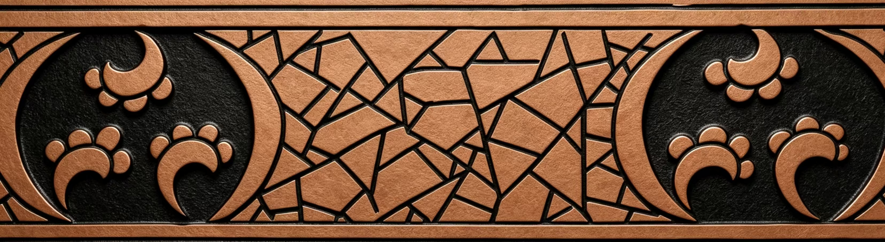
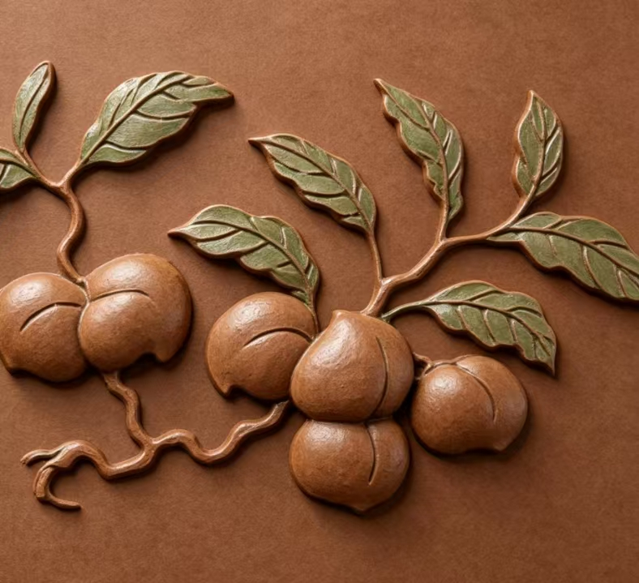
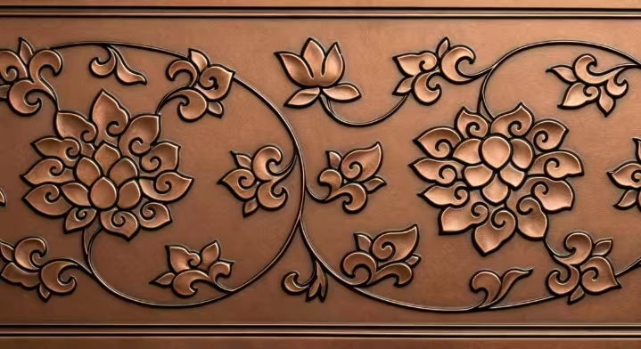

<section class="library-head">
  
DIGITAL CERTIFICATION

  <h2>数字确权</h2>
  
每一件修复文物都对应唯一的数字孪生资产，通过区块链哈希存证实现永久版权保护与溯源验证。

</section>

  

    DIGITAL ASSET
    
    

      
      链上验证中 · On-chain Verified
    

  

  

    <h2>龙纹青花大罐</h2>
    
Yuan Dynasty (1271–1368)

    

      

        🛡
        

          <strong>版权保障 (Copyright Protection)</strong>
          
Based on blockchain timestamp technology.

        

      

      

        🔗
        

          <strong>共创节点 (Co-creation Node)</strong>
          
Become a node in the dynamic art scroll.

        

      

    

    

      

        Token ID
        0xBDA699DD5
      

      

        Owner
        0xc4c00beb744f9
      

      

        Date
        2026/2/3
      

      

        Network
        Ethereum Mainnet
      

    

    <a class="btn-solid dr-cta" href="#">📄 查看链上记录</a>
  

  <h3 class="dr-steps-title">存证流程</h3>
  

    

      
01

      <strong>上传 (Upload)</strong>
      
高精度扫描文件与修复电子档案上传至系统

    

    
→

    

      
02

      <strong>哈希计算 (Hash)</strong>
      
SHA-256 算法生成文件唯一指纹，不可篡改

    

    
→

    

      
03

      <strong>区块打包 (Block)</strong>
      
哈希上链写入区块，永久存证可追溯

    

  

<section class="dr-gallery">
  <h3 class="dr-gallery-title">更多已确权文物</h3>
  

    

      

        
      

      

        
清代 · 景德镇官窑

        <strong>冰裂纹青花瓷瓶</strong>
        
Token: 0xA3F12...

        ✓ 已确权
      

    

    

      

        
      

      

        
明代 · 景德镇官窑

        <strong>青花花果纹瓷盘</strong>
        
Token: 0xC9E87...

        ✓ 已确权
      

    

    

      

        
      

      

        
明代 · 景德镇官窑

        <strong>缠枝纹青花瓷瓶</strong>
        
Token: 0xD4B21...

        ✓ 已确权
      

    

  

</section>
