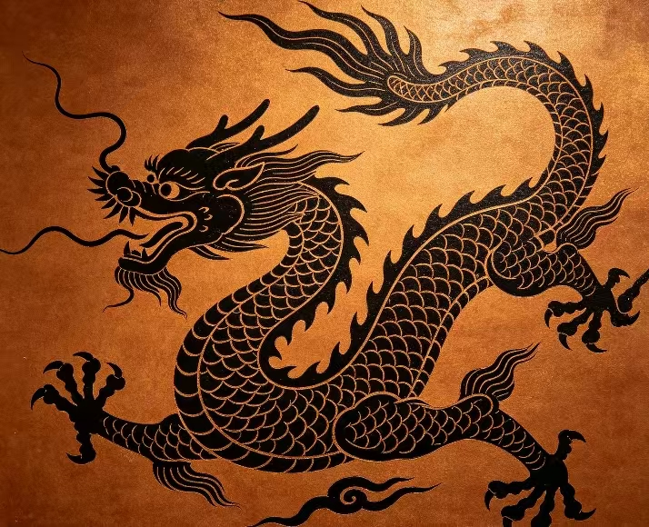

<section class="restoration-hero">
  

    
YIJING GALLERY · CULTURAL HERITAGE

    <h1>艺境·长廊数字焕新</h1>
    
当文物遇见人工智能，时间不再只是流逝的刻度。我们以修复、展示、对话与共创为核心，让中华文明在数字世界持续生长。

    

      <a class="btn-solid" href="exhibition/">开启探索</a>
      <a class="btn-outline" href="spirit-dialogue/">对话文物</a>
      <a class="btn-outline" href="digital-rights/">数字确权</a>
    

  

  

    

      
    

    

      
匹配精度

      <strong>99.8%</strong>
    

    

      
已收录纹样

      <strong>12,400+</strong>
    

  

</section>

<section class="home-capability">
  

    
IMMERSIVE CULTURAL EXPERIENCE

    <h2>虚实共生的文化场景</h2>
    
从静态展陈到动态交互，围绕文物构建“看得见、问得到、可共创、可确权”的一体化体验。

  

  

    <article class="home-capability-card">
      🧠
      <h3>AI 灵境对话</h3>
      
用自然语言与文物“交谈”，了解其工艺、历史与文化寓意。

      <a href="spirit-dialogue/">进入对话 →</a>
    </article>
    <article class="home-capability-card">
      🔐
      <h3>区块链确权</h3>
      
将文物数字资产上链存证，形成可追溯、可验证的版权记录。

      <a href="digital-rights/">查看确权 →</a>
    </article>
    <article class="home-capability-card">
      🗳️
      <h3>DAO 共创治理</h3>
      
社区成员通过提案与投票共同决定展览主题与内容演进。

      <a href="community/">加入共创 →</a>
    </article>
  

</section>

<section class="home-featured">
  

    
  

  

    
FEATURED ARTIFACT

    <h2>重器留痕，文明可触</h2>
    
龙纹青花大罐以浓烈钴蓝与磅礴器形展现元代审美风貌。通过高精度图像与结构化档案，我们将“器物本体 + 历史语境”完整呈现于数字空间。

    

      

        <strong>1271-1368</strong>
        元代纪年
      

      

        <strong>3D / 2K</strong>
        数字采样
      

    

    <a class="btn-solid" href="exhibition/">立即查看文物</a>
  

</section>

<section class="home-metrics">
  <article><strong>1,024</strong>收录文物</article>
  <article><strong>8.5M+</strong>AI 对话总量</article>
  <article><strong>50k</strong>社区用户</article>
  <article><strong>329</strong>共创提案</article>
</section>

<section class="home-cta">
  <h2>准备好开启这段时空旅程了吗？</h2>
  <a class="btn-solid" href="exhibition/">进入艺境长廊</a>
</section>
