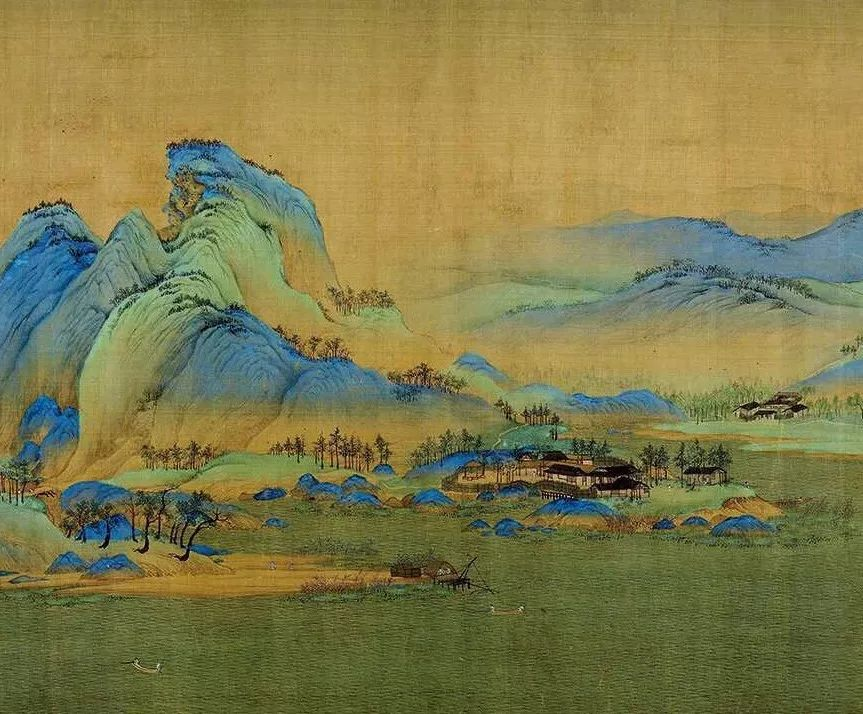
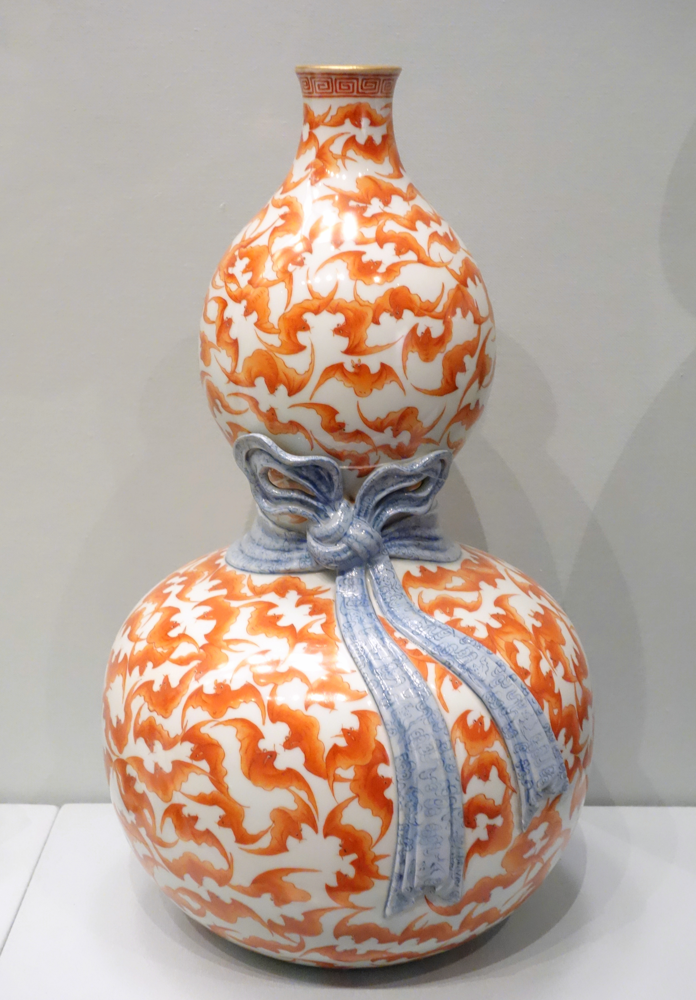

<section class="restoration-hero">
  

    
MING-QING IMPERIAL PORCELAIN · RESTORATION

    <h1>官窑重光瓷韵新生</h1>
    
当残损的明清官窑瓷器遇见数字技术，破碎不再是终点。我们通过高精度扫描采集器物纹样，与纹样库逐一比对匹配，据此复原缺失图案并完成修复，让沉睡的官窑重器重现昔日釉光与纹饰。

    

      <a class="btn-solid" href="exhibition/">开启探索</a>
      <a class="btn-outline" href="spirit-dialogue/">对话文物</a>
      <a class="btn-outline" href="digital-rights/">数字确权</a>
    

  

  

    

      
    

    

      
纹样匹配精度

      <strong>99.8%</strong>
    

    

      
已修复官窑器

      <strong>1,200+</strong>
    

  

</section>

<section class="home-capability">
  

    
IMMERSIVE CULTURAL EXPERIENCE

    <h2>虚实共生的文化场景</h2>
    
从静态展陈到动态交互，围绕文物构建“看得见、问得到、可共创、可确权”的一体化体验。

  

  

    <article class="home-capability-card">
      🧠
      <h3>AI 灵境对话</h3>
      
用自然语言与文物“交谈”，了解其工艺、历史与文化寓意。

      <a href="spirit-dialogue/">进入对话 →</a>
    </article>
    <article class="home-capability-card">
      🔐
      <h3>区块链确权</h3>
      
将文物数字资产上链存证，形成可追溯、可验证的版权记录。

      <a href="digital-rights/">查看确权 →</a>
    </article>
    <article class="home-capability-card">
      🗳️
      <h3>DAO 共创治理</h3>
      
社区成员通过提案与投票共同决定展览主题与内容演进。

      <a href="community/">加入共创 →</a>
    </article>
  

</section>

<section class="home-featured">
  

    
  

  

    
FEATURED RESTORATION

    <h2>残器重光，釉色再生</h2>
    
清乾隆景德镇官窑葫芦瓶，以红蝠纹寓“洪福”，釉上釉下彩交映，尽显盛清官窑之精丽。我们循“三维扫描采集 → 纹样库比对匹配 → 缺失纹饰复原 → 补釉随色修复”的流程，让残损重器重现往日釉光与纹饰。

    

      

        <strong>1736-1795</strong>
        乾隆纪年
      

      

        <strong>扫描 · 匹配 · 复原</strong>
        修复流程
      

    

    <a class="btn-solid" href="exhibition/">查看修复详情</a>
  

</section>

<section class="home-metrics">
  <article><strong>1,024</strong>收录文物</article>
  <article><strong>8.5M+</strong>AI 对话总量</article>
  <article><strong>50k</strong>社区用户</article>
  <article><strong>329</strong>共创提案</article>
</section>

<section class="home-cta">
  <h2>准备好开启这段时空旅程了吗？</h2>
  <a class="btn-solid" href="exhibition/">进入艺境长廊</a>
</section>
