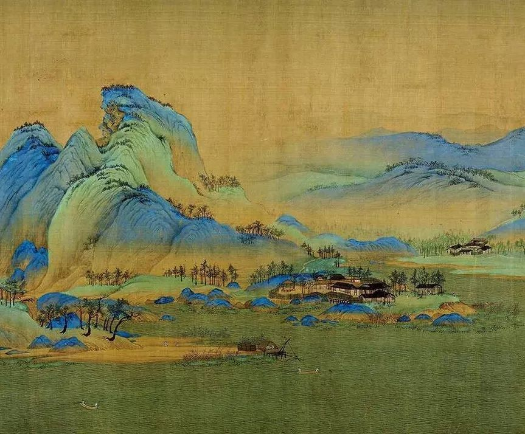

# 蓝色织金线绣花麒麟麟阁挂屏

<section class="pattern-detail">
  

    
  

  

    

      <h2>蓝色织金线绣花麒麟麟阁挂屏</h2>
      <a class="pattern-detail__fav" href="#">收藏</a>
    

    

      梅
      菊
      水
      杂宝
      太阳
    

    <article class="pattern-detail__info">
      

        <h3>基本信息</h3>
        
素材等级：C

      

      

        
<strong>朝代(时期)</strong>清

        
<strong>公元纪年</strong>1616年 - 1911年

        
<strong>载体&工艺</strong>织绣

        
<strong>所属器物</strong>屏

        
<strong>部位</strong>局部

        
<strong>纹样类别</strong>动物

        
<strong>组织形式</strong>适合

        
<strong>材质</strong>布

      

      
<strong>图案介绍：</strong>暂无介绍（这里后续替换为检索到的简述与出处）。

    </article>

    

      <a class="btn-solid" href="#">查看高清图</a>
      <a class="btn-outline" href="#">下载</a>
      <a class="btn-outline" href="#">加入清单</a>
    

  

</section>

## 纹样次序

### 纹样 001

### 纹样 002

### 纹样 003
