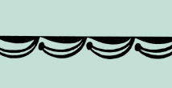
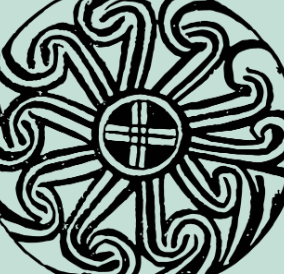
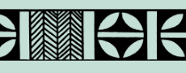
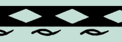
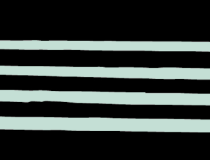
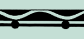



# 新石器时代

### 弧线圆点纹 {: .pattern-seq-anchor }

<section class="pattern-detail pattern-detail--seq">
    

        
    

    

        

            <h2>弧线圆点纹</h2>
            <a class="pattern-detail__fav" href="#">收藏</a>
        

        

            几何纹
            新石器时代
            几何纹
        

        <article class="pattern-detail__info">
            

                <h3>基本信息</h3>
                
素材等级：馆藏纹样

            

            

                
<strong>朝代(时期)</strong>新石器时代

                
<strong>公元纪年</strong>年代未详

                
<strong>纹样类别</strong>几何纹

                
<strong>所属器物</strong>陶瓷、织物或建筑构件

                
<strong>载体&工艺</strong>刻划、彩绘、印花或刺绣

                
<strong>材质</strong>土、石、金属、纺织品等

            

            
<strong>图案介绍：</strong>，常用于器物装饰、建筑彩绘或织绣图案。

        </article>

        

            <a class="btn-solid" href="#">查看高清图</a>
            <a class="btn-outline" href="#">下载</a>
            <a class="btn-outline" href="#">加入清单</a>
        

    

</section>

### 旋纹 {: .pattern-seq-anchor }

<section class="pattern-detail pattern-detail--seq">
    

        
    

    

        

            <h2>旋纹</h2>
            <a class="pattern-detail__fav" href="#">收藏</a>
        

        

            几何纹
            新石器时代
            几何纹
        

        <article class="pattern-detail__info">
            

                <h3>基本信息</h3>
                
素材等级：馆藏纹样

            

            

                
<strong>朝代(时期)</strong>新石器时代

                
<strong>公元纪年</strong>年代未详

                
<strong>纹样类别</strong>几何纹

                
<strong>所属器物</strong>陶瓷、织物或建筑构件

                
<strong>载体&工艺</strong>刻划、彩绘、印花或刺绣

                
<strong>材质</strong>土、石、金属、纺织品等

            

            
<strong>图案介绍：</strong>，常用于器物装饰、建筑彩绘或织绣图案。

        </article>

        

            <a class="btn-solid" href="#">查看高清图</a>
            <a class="btn-outline" href="#">下载</a>
            <a class="btn-outline" href="#">加入清单</a>
        

    

</section>

### 三角纹 {: .pattern-seq-anchor }

<section class="pattern-detail pattern-detail--seq">
    

        
    

    

        

            <h2>三角纹</h2>
            <a class="pattern-detail__fav" href="#">收藏</a>
        

        

            几何纹
            新石器时代
            几何纹
        

        <article class="pattern-detail__info">
            

                <h3>基本信息</h3>
                
素材等级：馆藏纹样

            

            

                
<strong>朝代(时期)</strong>新石器时代

                
<strong>公元纪年</strong>年代未详

                
<strong>纹样类别</strong>几何纹

                
<strong>所属器物</strong>陶瓷、织物或建筑构件

                
<strong>载体&工艺</strong>刻划、彩绘、印花或刺绣

                
<strong>材质</strong>土、石、金属、纺织品等

            

            
<strong>图案介绍：</strong>，常用于器物装饰、建筑彩绘或织绣图案。

        </article>

        

            <a class="btn-solid" href="#">查看高清图</a>
            <a class="btn-outline" href="#">下载</a>
            <a class="btn-outline" href="#">加入清单</a>
        

    

</section>

### 圆形三角编织纹 {: .pattern-seq-anchor }

<section class="pattern-detail pattern-detail--seq">
    

        
    

    

        

            <h2>圆形三角编织纹</h2>
            <a class="pattern-detail__fav" href="#">收藏</a>
        

        

            几何纹
            新石器时代
            几何纹
        

        <article class="pattern-detail__info">
            

                <h3>基本信息</h3>
                
素材等级：馆藏纹样

            

            

                
<strong>朝代(时期)</strong>新石器时代

                
<strong>公元纪年</strong>年代未详

                
<strong>纹样类别</strong>几何纹

                
<strong>所属器物</strong>陶瓷、织物或建筑构件

                
<strong>载体&工艺</strong>刻划、彩绘、印花或刺绣

                
<strong>材质</strong>土、石、金属、纺织品等

            

            
<strong>图案介绍：</strong>，常用于器物装饰、建筑彩绘或织绣图案。

        </article>

        

            <a class="btn-solid" href="#">查看高清图</a>
            <a class="btn-outline" href="#">下载</a>
            <a class="btn-outline" href="#">加入清单</a>
        

    

</section>

### 椭圆形三角纹 {: .pattern-seq-anchor }

<section class="pattern-detail pattern-detail--seq">
    

        
    

    

        

            <h2>椭圆形三角纹</h2>
            <a class="pattern-detail__fav" href="#">收藏</a>
        

        

            几何纹
            新石器时代
            几何纹
        

        <article class="pattern-detail__info">
            

                <h3>基本信息</h3>
                
素材等级：馆藏纹样

            

            

                
<strong>朝代(时期)</strong>新石器时代

                
<strong>公元纪年</strong>年代未详

                
<strong>纹样类别</strong>几何纹

                
<strong>所属器物</strong>陶瓷、织物或建筑构件

                
<strong>载体&工艺</strong>刻划、彩绘、印花或刺绣

                
<strong>材质</strong>土、石、金属、纺织品等

            

            
<strong>图案介绍：</strong>，常用于器物装饰、建筑彩绘或织绣图案。

        </article>

        

            <a class="btn-solid" href="#">查看高清图</a>
            <a class="btn-outline" href="#">下载</a>
            <a class="btn-outline" href="#">加入清单</a>
        

    

</section>

### 折线纹 {: .pattern-seq-anchor }

<section class="pattern-detail pattern-detail--seq">
    

        
    

    

        

            <h2>折线纹</h2>
            <a class="pattern-detail__fav" href="#">收藏</a>
        

        

            几何纹
            新石器时代
            几何纹
        

        <article class="pattern-detail__info">
            

                <h3>基本信息</h3>
                
素材等级：馆藏纹样

            

            

                
<strong>朝代(时期)</strong>新石器时代

                
<strong>公元纪年</strong>年代未详

                
<strong>纹样类别</strong>几何纹

                
<strong>所属器物</strong>陶瓷、织物或建筑构件

                
<strong>载体&工艺</strong>刻划、彩绘、印花或刺绣

                
<strong>材质</strong>土、石、金属、纺织品等

            

            
<strong>图案介绍：</strong>，常用于器物装饰、建筑彩绘或织绣图案。

        </article>

        

            <a class="btn-solid" href="#">查看高清图</a>
            <a class="btn-outline" href="#">下载</a>
            <a class="btn-outline" href="#">加入清单</a>
        

    

</section>

### 波折纹 {: .pattern-seq-anchor }

<section class="pattern-detail pattern-detail--seq">
    

        
    

    

        

            <h2>波折纹</h2>
            <a class="pattern-detail__fav" href="#">收藏</a>
        

        

            几何纹
            新石器时代
            几何纹
        

        <article class="pattern-detail__info">
            

                <h3>基本信息</h3>
                
素材等级：馆藏纹样

            

            

                
<strong>朝代(时期)</strong>新石器时代

                
<strong>公元纪年</strong>年代未详

                
<strong>纹样类别</strong>几何纹

                
<strong>所属器物</strong>陶瓷、织物或建筑构件

                
<strong>载体&工艺</strong>刻划、彩绘、印花或刺绣

                
<strong>材质</strong>土、石、金属、纺织品等

            

            
<strong>图案介绍：</strong>，常用于器物装饰、建筑彩绘或织绣图案。

        </article>

        

            <a class="btn-solid" href="#">查看高清图</a>
            <a class="btn-outline" href="#">下载</a>
            <a class="btn-outline" href="#">加入清单</a>
        

    

</section>

### 月牙圆点纹 {: .pattern-seq-anchor }

<section class="pattern-detail pattern-detail--seq">
    

        
    

    

        

            <h2>月牙圆点纹</h2>
            <a class="pattern-detail__fav" href="#">收藏</a>
        

        

            几何纹
            新石器时代
            几何纹
        

        <article class="pattern-detail__info">
            

                <h3>基本信息</h3>
                
素材等级：馆藏纹样

            

            

                
<strong>朝代(时期)</strong>新石器时代

                
<strong>公元纪年</strong>年代未详

                
<strong>纹样类别</strong>几何纹

                
<strong>所属器物</strong>陶瓷、织物或建筑构件

                
<strong>载体&工艺</strong>刻划、彩绘、印花或刺绣

                
<strong>材质</strong>土、石、金属、纺织品等

            

            
<strong>图案介绍：</strong>，常用于器物装饰、建筑彩绘或织绣图案。

        </article>

        

            <a class="btn-solid" href="#">查看高清图</a>
            <a class="btn-outline" href="#">下载</a>
            <a class="btn-outline" href="#">加入清单</a>
        

    

</section>

### 弧线圆点纹 {: .pattern-seq-anchor }

<section class="pattern-detail pattern-detail--seq">
    

        
    

    

        

            <h2>弧线圆点纹</h2>
            <a class="pattern-detail__fav" href="#">收藏</a>
        

        

            几何纹
            新石器时代
            几何纹
        

        <article class="pattern-detail__info">
            

                <h3>基本信息</h3>
                
素材等级：馆藏纹样

            

            

                
<strong>朝代(时期)</strong>新石器时代

                
<strong>公元纪年</strong>年代未详

                
<strong>纹样类别</strong>几何纹

                
<strong>所属器物</strong>陶瓷、织物或建筑构件

                
<strong>载体&工艺</strong>刻划、彩绘、印花或刺绣

                
<strong>材质</strong>土、石、金属、纺织品等

            

            
<strong>图案介绍：</strong>，常用于器物装饰、建筑彩绘或织绣图案。

        </article>

        

            <a class="btn-solid" href="#">查看高清图</a>
            <a class="btn-outline" href="#">下载</a>
            <a class="btn-outline" href="#">加入清单</a>
        

    

</section>

### 三角波折纹 {: .pattern-seq-anchor }

<section class="pattern-detail pattern-detail--seq">
    

        
    

    

        

            <h2>三角波折纹</h2>
            <a class="pattern-detail__fav" href="#">收藏</a>
        

        

            几何纹
            新石器时代
            几何纹
        

        <article class="pattern-detail__info">
            

                <h3>基本信息</h3>
                
素材等级：馆藏纹样

            

            

                
<strong>朝代(时期)</strong>新石器时代

                
<strong>公元纪年</strong>年代未详

                
<strong>纹样类别</strong>几何纹

                
<strong>所属器物</strong>陶瓷、织物或建筑构件

                
<strong>载体&工艺</strong>刻划、彩绘、印花或刺绣

                
<strong>材质</strong>土、石、金属、纺织品等

            

            
<strong>图案介绍：</strong>，常用于器物装饰、建筑彩绘或织绣图案。

        </article>

        

            <a class="btn-solid" href="#">查看高清图</a>
            <a class="btn-outline" href="#">下载</a>
            <a class="btn-outline" href="#">加入清单</a>
        

    

</section>

### 菱形叶纹 {: .pattern-seq-anchor }

<section class="pattern-detail pattern-detail--seq">
    

        
    

    

        

            <h2>菱形叶纹</h2>
            <a class="pattern-detail__fav" href="#">收藏</a>
        

        

            几何纹
            新石器时代
            几何纹
        

        <article class="pattern-detail__info">
            

                <h3>基本信息</h3>
                
素材等级：馆藏纹样

            

            

                
<strong>朝代(时期)</strong>新石器时代

                
<strong>公元纪年</strong>年代未详

                
<strong>纹样类别</strong>几何纹

                
<strong>所属器物</strong>陶瓷、织物或建筑构件

                
<strong>载体&工艺</strong>刻划、彩绘、印花或刺绣

                
<strong>材质</strong>土、石、金属、纺织品等

            

            
<strong>图案介绍：</strong>，常用于器物装饰、建筑彩绘或织绣图案。

        </article>

        

            <a class="btn-solid" href="#">查看高清图</a>
            <a class="btn-outline" href="#">下载</a>
            <a class="btn-outline" href="#">加入清单</a>
        

    

</section>

### 横平行线纹 {: .pattern-seq-anchor }

<section class="pattern-detail pattern-detail--seq">
    

        
    

    

        

            <h2>横平行线纹</h2>
            <a class="pattern-detail__fav" href="#">收藏</a>
        

        

            几何纹
            新石器时代
            几何纹
        

        <article class="pattern-detail__info">
            

                <h3>基本信息</h3>
                
素材等级：馆藏纹样

            

            

                
<strong>朝代(时期)</strong>新石器时代

                
<strong>公元纪年</strong>年代未详

                
<strong>纹样类别</strong>几何纹

                
<strong>所属器物</strong>陶瓷、织物或建筑构件

                
<strong>载体&工艺</strong>刻划、彩绘、印花或刺绣

                
<strong>材质</strong>土、石、金属、纺织品等

            

            
<strong>图案介绍：</strong>，常用于器物装饰、建筑彩绘或织绣图案。

        </article>

        

            <a class="btn-solid" href="#">查看高清图</a>
            <a class="btn-outline" href="#">下载</a>
            <a class="btn-outline" href="#">加入清单</a>
        

    

</section>

### 断线纹 {: .pattern-seq-anchor }

<section class="pattern-detail pattern-detail--seq">
    

        
    

    

        

            <h2>断线纹</h2>
            <a class="pattern-detail__fav" href="#">收藏</a>
        

        

            几何纹
            新石器时代
            几何纹
        

        <article class="pattern-detail__info">
            

                <h3>基本信息</h3>
                
素材等级：馆藏纹样

            

            

                
<strong>朝代(时期)</strong>新石器时代

                
<strong>公元纪年</strong>年代未详

                
<strong>纹样类别</strong>几何纹

                
<strong>所属器物</strong>陶瓷、织物或建筑构件

                
<strong>载体&工艺</strong>刻划、彩绘、印花或刺绣

                
<strong>材质</strong>土、石、金属、纺织品等

            

            
<strong>图案介绍：</strong>，常用于器物装饰、建筑彩绘或织绣图案。

        </article>

        

            <a class="btn-solid" href="#">查看高清图</a>
            <a class="btn-outline" href="#">下载</a>
            <a class="btn-outline" href="#">加入清单</a>
        

    

</section>

### 波线圆点纹 {: .pattern-seq-anchor }

<section class="pattern-detail pattern-detail--seq">
    

        
    

    

        

            <h2>波线圆点纹</h2>
            <a class="pattern-detail__fav" href="#">收藏</a>
        

        

            几何纹
            新石器时代
            几何纹
        

        <article class="pattern-detail__info">
            

                <h3>基本信息</h3>
                
素材等级：馆藏纹样

            

            

                
<strong>朝代(时期)</strong>新石器时代

                
<strong>公元纪年</strong>年代未详

                
<strong>纹样类别</strong>几何纹

                
<strong>所属器物</strong>陶瓷、织物或建筑构件

                
<strong>载体&工艺</strong>刻划、彩绘、印花或刺绣

                
<strong>材质</strong>土、石、金属、纺织品等

            

            
<strong>图案介绍：</strong>，常用于器物装饰、建筑彩绘或织绣图案。

        </article>

        

            <a class="btn-solid" href="#">查看高清图</a>
            <a class="btn-outline" href="#">下载</a>
            <a class="btn-outline" href="#">加入清单</a>
        

    

</section>

