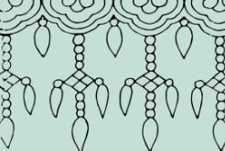
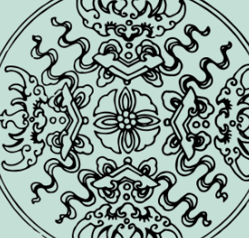
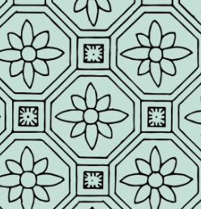
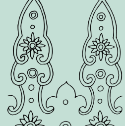



# 清

### 冰裂纹 {: .pattern-seq-anchor }

<section class="pattern-detail pattern-detail--seq">
    

        
    

    

        

            <h2>冰裂纹</h2>
            <a class="pattern-detail__fav" href="#">收藏</a>
        

        

            连续
            清代
            连续
        

        <article class="pattern-detail__info">
            

                <h3>基本信息</h3>
                
素材等级：馆藏纹样

            

            

                
<strong>朝代(时期)</strong>清代

                
<strong>公元纪年</strong>年代未详

                
<strong>纹样类别</strong>连续

                
<strong>所属器物</strong>陶瓷、织物或建筑构件

                
<strong>载体&工艺</strong>刻划、彩绘、印花或刺绣

                
<strong>材质</strong>土、石、金属、纺织品等

            

            
<strong>图案介绍：</strong>，常用于器物装饰、建筑彩绘或织绣图案。

        </article>

        

            <a class="btn-solid" href="#">查看高清图</a>
            <a class="btn-outline" href="#">下载</a>
            <a class="btn-outline" href="#">加入清单</a>
        

    

</section>

### 璎珞纹 {: .pattern-seq-anchor }

<section class="pattern-detail pattern-detail--seq">
    

        
    

    

        

            <h2>璎珞纹</h2>
            <a class="pattern-detail__fav" href="#">收藏</a>
        

        

            几何纹
            清代
            几何纹
        

        <article class="pattern-detail__info">
            

                <h3>基本信息</h3>
                
素材等级：馆藏纹样

            

            

                
<strong>朝代(时期)</strong>清代

                
<strong>公元纪年</strong>年代未详

                
<strong>纹样类别</strong>几何纹

                
<strong>所属器物</strong>陶瓷、织物或建筑构件

                
<strong>载体&工艺</strong>刻划、彩绘、印花或刺绣

                
<strong>材质</strong>土、石、金属、纺织品等

            

            
<strong>图案介绍：</strong>，常用于器物装饰、建筑彩绘或织绣图案。

        </article>

        

            <a class="btn-solid" href="#">查看高清图</a>
            <a class="btn-outline" href="#">下载</a>
            <a class="btn-outline" href="#">加入清单</a>
        

    

</section>

### 福庆纹 {: .pattern-seq-anchor }

<section class="pattern-detail pattern-detail--seq">
    

        
    

    

        

            <h2>福庆纹</h2>
            <a class="pattern-detail__fav" href="#">收藏</a>
        

        

            几何纹
            清代
            几何纹
        

        <article class="pattern-detail__info">
            

                <h3>基本信息</h3>
                
素材等级：馆藏纹样

            

            

                
<strong>朝代(时期)</strong>清代

                
<strong>公元纪年</strong>年代未详

                
<strong>纹样类别</strong>几何纹

                
<strong>所属器物</strong>陶瓷、织物或建筑构件

                
<strong>载体&工艺</strong>刻划、彩绘、印花或刺绣

                
<strong>材质</strong>土、石、金属、纺织品等

            

            
<strong>图案介绍：</strong>，常用于器物装饰、建筑彩绘或织绣图案。

        </article>

        

            <a class="btn-solid" href="#">查看高清图</a>
            <a class="btn-outline" href="#">下载</a>
            <a class="btn-outline" href="#">加入清单</a>
        

    

</section>

### 古彩锦纹 {: .pattern-seq-anchor }

<section class="pattern-detail pattern-detail--seq">
    

        
    

    

        

            <h2>古彩锦纹</h2>
            <a class="pattern-detail__fav" href="#">收藏</a>
        

        

            几何纹
            清代
            几何纹
        

        <article class="pattern-detail__info">
            

                <h3>基本信息</h3>
                
素材等级：馆藏纹样

            

            

                
<strong>朝代(时期)</strong>清代

                
<strong>公元纪年</strong>年代未详

                
<strong>纹样类别</strong>几何纹

                
<strong>所属器物</strong>陶瓷、织物或建筑构件

                
<strong>载体&工艺</strong>刻划、彩绘、印花或刺绣

                
<strong>材质</strong>土、石、金属、纺织品等

            

            
<strong>图案介绍：</strong>，常用于器物装饰、建筑彩绘或织绣图案。

        </article>

        

            <a class="btn-solid" href="#">查看高清图</a>
            <a class="btn-outline" href="#">下载</a>
            <a class="btn-outline" href="#">加入清单</a>
        

    

</section>

### 如意纹 {: .pattern-seq-anchor }

<section class="pattern-detail pattern-detail--seq">
    

        
    

    

        

            <h2>如意纹</h2>
            <a class="pattern-detail__fav" href="#">收藏</a>
        

        

            几何纹
            清代
            几何纹
        

        <article class="pattern-detail__info">
            

                <h3>基本信息</h3>
                
素材等级：馆藏纹样

            

            

                
<strong>朝代(时期)</strong>清代

                
<strong>公元纪年</strong>年代未详

                
<strong>纹样类别</strong>几何纹

                
<strong>所属器物</strong>陶瓷、织物或建筑构件

                
<strong>载体&工艺</strong>刻划、彩绘、印花或刺绣

                
<strong>材质</strong>土、石、金属、纺织品等

            

            
<strong>图案介绍：</strong>，常用于器物装饰、建筑彩绘或织绣图案。

        </article>

        

            <a class="btn-solid" href="#">查看高清图</a>
            <a class="btn-outline" href="#">下载</a>
            <a class="btn-outline" href="#">加入清单</a>
        

    

</section>

