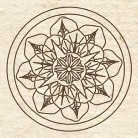
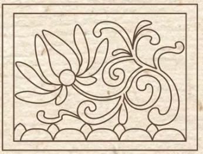
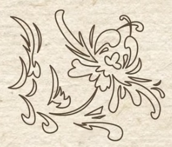
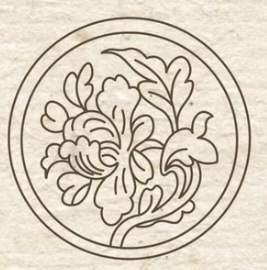
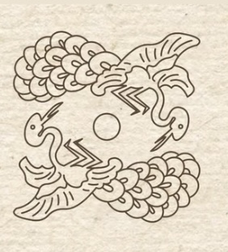
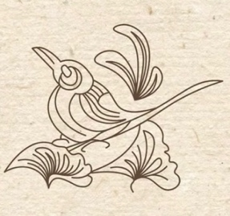
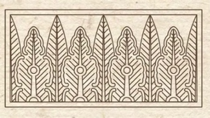
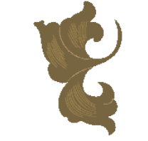
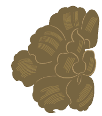
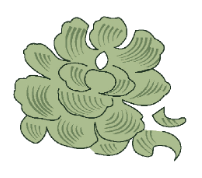





# 宋代

<section class="pattern-detail">    
            
    
        
            <h2>简单花卉纹样</h2>            <a class="pattern-detail__fav" href="#">收藏</a>        


        
            植物纹            宋代            植物纹        


        <article class="pattern-detail__info">            
                <h3>基本信息</h3>                
素材等级：馆藏纹样
            
            
                
<strong>朝代(时期)</strong>宋代
                
<strong>公元纪年</strong>960年 - 1279年
                
<strong>纹样类别</strong>植物纹
                
<strong>所属器物</strong>陶瓷、织物或建筑构件
                
<strong>载体&工艺</strong>刻划、彩绘、印花或刺绣
                
<strong>材质</strong>土、石、金属、纺织品等
            
            
<strong>图案介绍：</strong>简单花卉纹样为宋时期常见的植物纹题材之一，常用于器物装饰、建筑彩绘或织绣图案，具有较强的装饰性与时代审美特征。
        </article>

        
            <a class="btn-solid" href="#">查看高清图</a>            <a class="btn-outline" href="#">下载</a>            <a class="btn-outline" href="#">加入清单</a>        
    
</section>

## 纹样次序

### 莲纹 {: .pattern-seq-anchor }

<section class="pattern-detail pattern-detail--seq">    
            
    
        
            <h2>莲纹</h2>            <a class="pattern-detail__fav" href="#">收藏</a>        


        
            植物纹            宋代            植物纹        


        <article class="pattern-detail__info">            
                <h3>基本信息</h3>                
素材等级：馆藏纹样
            
            
                
<strong>朝代(时期)</strong>宋代
                
<strong>公元纪年</strong>年代未详
                
<strong>纹样类别</strong>植物纹
                
<strong>所属器物</strong>陶瓷、织物或建筑构件
                
<strong>载体&工艺</strong>刻划、彩绘、印花或刺绣
                
<strong>材质</strong>土、石、金属、纺织品等
            
            
<strong>图案介绍：</strong>莲纹为宋代时期常见的植物纹题材之一，常用于器物装饰、建筑彩绘或织绣图案。
        </article>

        
            <a class="btn-solid" href="#">查看高清图</a>            <a class="btn-outline" href="#">下载</a>            <a class="btn-outline" href="#">加入清单</a>        
    
</section>

### 莲花纹 {: .pattern-seq-anchor }

<section class="pattern-detail pattern-detail--seq">    
            
    
        
            <h2>莲花纹</h2>            <a class="pattern-detail__fav" href="#">收藏</a>        


        
            植物纹            宋代            植物纹        


        <article class="pattern-detail__info">            
                <h3>基本信息</h3>                
素材等级：馆藏纹样
            
            
                
<strong>朝代(时期)</strong>宋代
                
<strong>公元纪年</strong>年代未详
                
<strong>纹样类别</strong>植物纹
                
<strong>所属器物</strong>陶瓷、织物或建筑构件
                
<strong>载体&工艺</strong>刻划、彩绘、印花或刺绣
                
<strong>材质</strong>土、石、金属、纺织品等
            
            
<strong>图案介绍：</strong>莲花纹为宋代时期常见的植物纹题材之一，常用于器物装饰、建筑彩绘或织绣图案。
        </article>

        
            <a class="btn-solid" href="#">查看高清图</a>            <a class="btn-outline" href="#">下载</a>            <a class="btn-outline" href="#">加入清单</a>        
    
</section>

### 菊花纹 {: .pattern-seq-anchor }

<section class="pattern-detail pattern-detail--seq">    
            
    
        
            <h2>菊花纹</h2>            <a class="pattern-detail__fav" href="#">收藏</a>        


        
            植物纹            宋代            植物纹        


        <article class="pattern-detail__info">            
                <h3>基本信息</h3>                
素材等级：馆藏纹样
            
            
                
<strong>朝代(时期)</strong>宋代
                
<strong>公元纪年</strong>年代未详
                
<strong>纹样类别</strong>植物纹
                
<strong>所属器物</strong>陶瓷、织物或建筑构件
                
<strong>载体&工艺</strong>刻划、彩绘、印花或刺绣
                
<strong>材质</strong>土、石、金属、纺织品等
            
            
<strong>图案介绍：</strong>菊花纹为宋代时期常见的植物纹题材之一，常用于器物装饰、建筑彩绘或织绣图案。
        </article>

        
            <a class="btn-solid" href="#">查看高清图</a>            <a class="btn-outline" href="#">下载</a>            <a class="btn-outline" href="#">加入清单</a>        
    
</section>

### 牡丹纹 {: .pattern-seq-anchor }

<section class="pattern-detail pattern-detail--seq">    
            
    
        
            <h2>牡丹纹</h2>            <a class="pattern-detail__fav" href="#">收藏</a>        


        
            植物纹            宋代            植物纹        


        <article class="pattern-detail__info">            
                <h3>基本信息</h3>                
素材等级：馆藏纹样
            
            
                
<strong>朝代(时期)</strong>宋代
                
<strong>公元纪年</strong>年代未详
                
<strong>纹样类别</strong>植物纹
                
<strong>所属器物</strong>陶瓷、织物或建筑构件
                
<strong>载体&工艺</strong>刻划、彩绘、印花或刺绣
                
<strong>材质</strong>土、石、金属、纺织品等
            
            
<strong>图案介绍：</strong>牡丹纹为宋代时期常见的植物纹题材之一，常用于器物装饰、建筑彩绘或织绣图案。
        </article>

        
            <a class="btn-solid" href="#">查看高清图</a>            <a class="btn-outline" href="#">下载</a>            <a class="btn-outline" href="#">加入清单</a>        
    
</section>

### 孔雀纹 {: .pattern-seq-anchor }

<section class="pattern-detail pattern-detail--seq">    
            
    
        
            <h2>孔雀纹</h2>            <a class="pattern-detail__fav" href="#">收藏</a>        


        
            动物纹            宋代            动物纹        


        <article class="pattern-detail__info">            
                <h3>基本信息</h3>                
素材等级：馆藏纹样
            
            
                
<strong>朝代(时期)</strong>宋代
                
<strong>公元纪年</strong>年代未详
                
<strong>纹样类别</strong>动物纹
                
<strong>所属器物</strong>陶瓷、织物或建筑构件
                
<strong>载体&工艺</strong>刻划、彩绘、印花或刺绣
                
<strong>材质</strong>土、石、金属、纺织品等
            
            
<strong>图案介绍：</strong>孔雀纹为宋代时期常见的动物纹题材之一，常用于器物装饰、建筑彩绘或织绣图案。
        </article>

        
            <a class="btn-solid" href="#">查看高清图</a>            <a class="btn-outline" href="#">下载</a>            <a class="btn-outline" href="#">加入清单</a>        
    
</section>

### 鸟纹 {: .pattern-seq-anchor }

<section class="pattern-detail pattern-detail--seq">    
            
    
        
            <h2>鸟纹</h2>            <a class="pattern-detail__fav" href="#">收藏</a>        


        
            动物纹            宋代            动物纹        


        <article class="pattern-detail__info">            
                <h3>基本信息</h3>                
素材等级：馆藏纹样
            
            
                
<strong>朝代(时期)</strong>宋代
                
<strong>公元纪年</strong>年代未详
                
<strong>纹样类别</strong>动物纹
                
<strong>所属器物</strong>陶瓷、织物或建筑构件
                
<strong>载体&工艺</strong>刻划、彩绘、印花或刺绣
                
<strong>材质</strong>土、石、金属、纺织品等
            
            
<strong>图案介绍：</strong>鸟纹为宋代时期常见的动物纹题材之一，常用于器物装饰、建筑彩绘或织绣图案。
        </article>

        
            <a class="btn-solid" href="#">查看高清图</a>            <a class="btn-outline" href="#">下载</a>            <a class="btn-outline" href="#">加入清单</a>        
    
</section>

### 蕉叶纹 {: .pattern-seq-anchor }

<section class="pattern-detail pattern-detail--seq">    
            
    
        
            <h2>蕉叶纹</h2>            <a class="pattern-detail__fav" href="#">收藏</a>        


        
            植物纹            宋代            植物纹        


        <article class="pattern-detail__info">            
                <h3>基本信息</h3>                
素材等级：馆藏纹样
            
            
                
<strong>朝代(时期)</strong>宋代
                
<strong>公元纪年</strong>年代未详
                
<strong>纹样类别</strong>植物纹
                
<strong>所属器物</strong>陶瓷、织物或建筑构件
                
<strong>载体&工艺</strong>刻划、彩绘、印花或刺绣
                
<strong>材质</strong>土、石、金属、纺织品等
            
            
<strong>图案介绍：</strong>蕉叶纹为宋代时期常见的植物纹题材之一，常用于器物装饰、建筑彩绘或织绣图案。
        </article>

        
            <a class="btn-solid" href="#">查看高清图</a>            <a class="btn-outline" href="#">下载</a>            <a class="btn-outline" href="#">加入清单</a>        
    
</section>

### 草叶纹 {: .pattern-seq-anchor }

<section class="pattern-detail pattern-detail--seq">    
            
    
        
            <h2>草叶纹</h2>            <a class="pattern-detail__fav" href="#">收藏</a>        


        
            植物纹            宋代            植物纹        


        <article class="pattern-detail__info">            
                <h3>基本信息</h3>                
素材等级：馆藏纹样
            
            
                
<strong>朝代(时期)</strong>宋代
                
<strong>公元纪年</strong>年代未详
                
<strong>纹样类别</strong>植物纹
                
<strong>所属器物</strong>陶瓷、织物或建筑构件
                
<strong>载体&工艺</strong>刻划、彩绘、印花或刺绣
                
<strong>材质</strong>土、石、金属、纺织品等
            
            
<strong>图案介绍：</strong>草叶纹为宋代时期常见的植物纹题材之一，常用于器物装饰、建筑彩绘或织绣图案。
        </article>

        
            <a class="btn-solid" href="#">查看高清图</a>            <a class="btn-outline" href="#">下载</a>            <a class="btn-outline" href="#">加入清单</a>        
    
</section>

### 花草纹 {: .pattern-seq-anchor }

<section class="pattern-detail pattern-detail--seq">    
            
    
        
            <h2>花草纹</h2>            <a class="pattern-detail__fav" href="#">收藏</a>        


        
            植物纹            宋代            植物纹        


        <article class="pattern-detail__info">            
                <h3>基本信息</h3>                
素材等级：馆藏纹样
            
            
                
<strong>朝代(时期)</strong>宋代
                
<strong>公元纪年</strong>年代未详
                
<strong>纹样类别</strong>植物纹
                
<strong>所属器物</strong>陶瓷、织物或建筑构件
                
<strong>载体&工艺</strong>刻划、彩绘、印花或刺绣
                
<strong>材质</strong>土、石、金属、纺织品等
            
            
<strong>图案介绍：</strong>花草纹为宋代时期常见的植物纹题材之一，常用于器物装饰、建筑彩绘或织绣图案。
        </article>

        
            <a class="btn-solid" href="#">查看高清图</a>            <a class="btn-outline" href="#">下载</a>            <a class="btn-outline" href="#">加入清单</a>        
    
</section>

### 折枝花卉纹 {: .pattern-seq-anchor }

<section class="pattern-detail pattern-detail--seq">    
            
    
        
            <h2>折枝花卉纹</h2>            <a class="pattern-detail__fav" href="#">收藏</a>        


        
            植物纹            宋代            植物纹        


        <article class="pattern-detail__info">            
                <h3>基本信息</h3>                
素材等级：馆藏纹样
            
            
                
<strong>朝代(时期)</strong>宋代
                
<strong>公元纪年</strong>年代未详
                
<strong>纹样类别</strong>植物纹
                
<strong>所属器物</strong>陶瓷、织物或建筑构件
                
<strong>载体&工艺</strong>刻划、彩绘、印花或刺绣
                
<strong>材质</strong>土、石、金属、纺织品等
            
            
<strong>图案介绍：</strong>折枝花卉纹为宋代时期常见的植物纹题材之一，常用于器物装饰、建筑彩绘或织绣图案。
        </article>

        
            <a class="btn-solid" href="#">查看高清图</a>            <a class="btn-outline" href="#">下载</a>            <a class="btn-outline" href="#">加入清单</a>        
    
</section>








