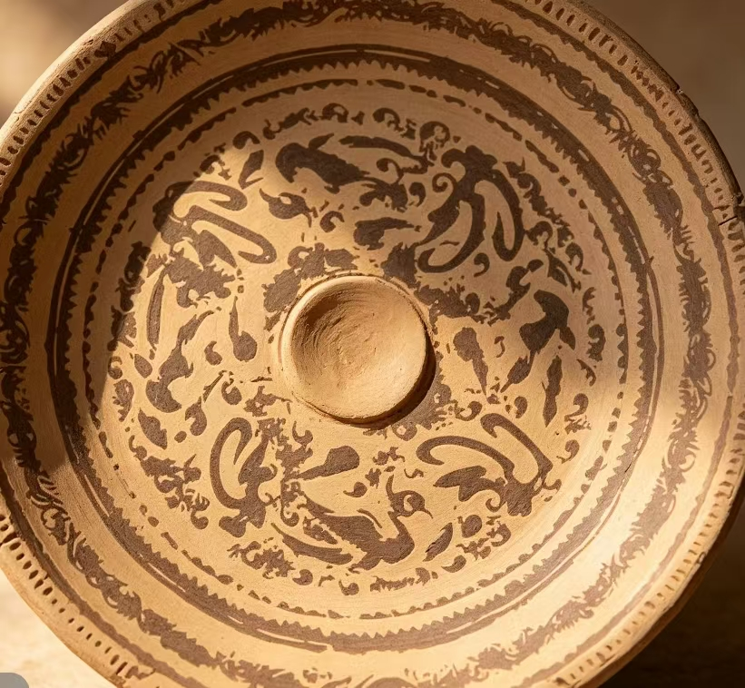

# 隋

<section class="pattern-detail">
	

		
	

	

		

			<h2>莲瓣纹</h2>
			<a class="pattern-detail__fav" href="#">收藏</a>
		

		

			莲
			莲瓣
			隋代
			动物纹
		

		<article class="pattern-detail__info">
			

				<h3>基本信息</h3>
				
素材等级：C

			

			

				
<strong>朝代(时期)</strong>隋

				
<strong>公元纪年</strong>581年 - 618年

				
<strong>纹样类别</strong>动物纹

				
<strong>所属器物</strong>陶盘（待核）

				
<strong>载体&工艺</strong>陶器彩绘（待核）

				
<strong>材质</strong>陶

			

			
<strong>图案介绍：</strong>该纹样以莲瓣与动物形元素组合构成，采用环形连续布局，具有明显的装饰节奏感，体现了隋代纹样由礼制符号向世俗审美过渡的特征。

		</article>
	

</section>

## 纹样次序

### 纹样 001 · 莲瓣纹

### 纹样 002

### 纹样 003

### 纹样 004
