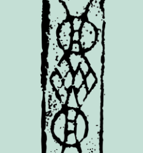
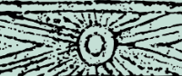
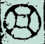
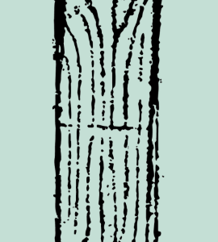
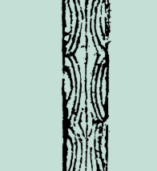





# 不详

<section class="pattern-detail">    
            
    
        
            <h2>网钱纹</h2>            <a class="pattern-detail__fav" href="#">收藏</a>        


        
            几何纹            不详            几何纹        


        <article class="pattern-detail__info">            
                <h3>基本信息</h3>                
素材等级：馆藏纹样
            
            
                
<strong>朝代(时期)</strong>不详
                
<strong>公元纪年</strong>年代未详
                
<strong>纹样类别</strong>几何纹
                
<strong>所属器物</strong>陶瓷、织物或建筑构件
                
<strong>载体&工艺</strong>刻划、彩绘、印花或刺绣
                
<strong>材质</strong>土、石、金属、纺织品等
            
            
<strong>图案介绍：</strong>网钱纹为不详时期常见的几何纹题材之一，常用于器物装饰、建筑彩绘或织绣图案，具有较强的装饰性与时代审美特征。
        </article>

        
            <a class="btn-solid" href="#">查看高清图</a>            <a class="btn-outline" href="#">下载</a>            <a class="btn-outline" href="#">加入清单</a>        
    
</section>

## 纹样次序

### 套菱纹 {: .pattern-seq-anchor }

<section class="pattern-detail pattern-detail--seq">    
            
    
        
            <h2>套菱纹</h2>            <a class="pattern-detail__fav" href="#">收藏</a>        


        
            几何纹            西晋            几何纹        


        <article class="pattern-detail__info">            
                <h3>基本信息</h3>                
素材等级：馆藏纹样
            
            
                
<strong>朝代(时期)</strong>西晋
                
<strong>公元纪年</strong>年代未详
                
<strong>纹样类别</strong>几何纹
                
<strong>所属器物</strong>陶瓷、织物或建筑构件
                
<strong>载体&工艺</strong>刻划、彩绘、印花或刺绣
                
<strong>材质</strong>土、石、金属、纺织品等
            
            
<strong>图案介绍：</strong>套菱纹为西晋时期常见的几何纹题材之一，常用于器物装饰、建筑彩绘或织绣图案。
        </article>

        
            <a class="btn-solid" href="#">查看高清图</a>            <a class="btn-outline" href="#">下载</a>            <a class="btn-outline" href="#">加入清单</a>        
    
</section>

### 齿轮纹 {: .pattern-seq-anchor }

<section class="pattern-detail pattern-detail--seq">    
            
    
        
            <h2>齿轮纹</h2>            <a class="pattern-detail__fav" href="#">收藏</a>        


        
            几何纹            西晋            几何纹        


        <article class="pattern-detail__info">            
                <h3>基本信息</h3>                
素材等级：馆藏纹样
            
            
                
<strong>朝代(时期)</strong>西晋
                
<strong>公元纪年</strong>年代未详
                
<strong>纹样类别</strong>几何纹
                
<strong>所属器物</strong>陶瓷、织物或建筑构件
                
<strong>载体&工艺</strong>刻划、彩绘、印花或刺绣
                
<strong>材质</strong>土、石、金属、纺织品等
            
            
<strong>图案介绍：</strong>齿轮纹为西晋时期常见的几何纹题材之一，常用于器物装饰、建筑彩绘或织绣图案。
        </article>

        
            <a class="btn-solid" href="#">查看高清图</a>            <a class="btn-outline" href="#">下载</a>            <a class="btn-outline" href="#">加入清单</a>        
    
</section>

### 圆钱纹 {: .pattern-seq-anchor }

<section class="pattern-detail pattern-detail--seq">    
            
    
        
            <h2>圆钱纹</h2>            <a class="pattern-detail__fav" href="#">收藏</a>        


        
            几何纹            西晋            几何纹        


        <article class="pattern-detail__info">            
                <h3>基本信息</h3>                
素材等级：馆藏纹样
            
            
                
<strong>朝代(时期)</strong>西晋
                
<strong>公元纪年</strong>年代未详
                
<strong>纹样类别</strong>几何纹
                
<strong>所属器物</strong>陶瓷、织物或建筑构件
                
<strong>载体&工艺</strong>刻划、彩绘、印花或刺绣
                
<strong>材质</strong>土、石、金属、纺织品等
            
            
<strong>图案介绍：</strong>圆钱纹为西晋时期常见的几何纹题材之一，常用于器物装饰、建筑彩绘或织绣图案。
        </article>

        
            <a class="btn-solid" href="#">查看高清图</a>            <a class="btn-outline" href="#">下载</a>            <a class="btn-outline" href="#">加入清单</a>        
    
</section>

### 乳钉纹 {: .pattern-seq-anchor }

<section class="pattern-detail pattern-detail--seq">    
            
    
        
            <h2>乳钉纹</h2>            <a class="pattern-detail__fav" href="#">收藏</a>        


        
            几何纹            西晋            几何纹        


        <article class="pattern-detail__info">            
                <h3>基本信息</h3>                
素材等级：馆藏纹样
            
            
                
<strong>朝代(时期)</strong>西晋
                
<strong>公元纪年</strong>年代未详
                
<strong>纹样类别</strong>几何纹
                
<strong>所属器物</strong>陶瓷、织物或建筑构件
                
<strong>载体&工艺</strong>刻划、彩绘、印花或刺绣
                
<strong>材质</strong>土、石、金属、纺织品等
            
            
<strong>图案介绍：</strong>乳钉纹为西晋时期常见的几何纹题材之一，常用于器物装饰、建筑彩绘或织绣图案。
        </article>

        
            <a class="btn-solid" href="#">查看高清图</a>            <a class="btn-outline" href="#">下载</a>            <a class="btn-outline" href="#">加入清单</a>        
    
</section>

### 竖线纹 {: .pattern-seq-anchor }

<section class="pattern-detail pattern-detail--seq">    
            
    
        
            <h2>竖线纹</h2>            <a class="pattern-detail__fav" href="#">收藏</a>        


        
            几何纹            北魏            几何纹        


        <article class="pattern-detail__info">            
                <h3>基本信息</h3>                
素材等级：馆藏纹样
            
            
                
<strong>朝代(时期)</strong>北魏
                
<strong>公元纪年</strong>年代未详
                
<strong>纹样类别</strong>几何纹
                
<strong>所属器物</strong>陶瓷、织物或建筑构件
                
<strong>载体&工艺</strong>刻划、彩绘、印花或刺绣
                
<strong>材质</strong>土、石、金属、纺织品等
            
            
<strong>图案介绍：</strong>竖线纹为北魏时期常见的几何纹题材之一，常用于器物装饰、建筑彩绘或织绣图案。
        </article>

        
            <a class="btn-solid" href="#">查看高清图</a>            <a class="btn-outline" href="#">下载</a>            <a class="btn-outline" href="#">加入清单</a>        
    
</section>

### 方格纹 {: .pattern-seq-anchor }

<section class="pattern-detail pattern-detail--seq">    
            
    
        
            <h2>方格纹</h2>            <a class="pattern-detail__fav" href="#">收藏</a>        


        
            几何纹            北魏            几何纹        


        <article class="pattern-detail__info">            
                <h3>基本信息</h3>                
素材等级：馆藏纹样
            
            
                
<strong>朝代(时期)</strong>北魏
                
<strong>公元纪年</strong>年代未详
                
<strong>纹样类别</strong>几何纹
                
<strong>所属器物</strong>陶瓷、织物或建筑构件
                
<strong>载体&工艺</strong>刻划、彩绘、印花或刺绣
                
<strong>材质</strong>土、石、金属、纺织品等
            
            
<strong>图案介绍：</strong>方格纹为北魏时期常见的几何纹题材之一，常用于器物装饰、建筑彩绘或织绣图案。
        </article>

        
            <a class="btn-solid" href="#">查看高清图</a>            <a class="btn-outline" href="#">下载</a>            <a class="btn-outline" href="#">加入清单</a>        
    
</section>

### 钱纹 {: .pattern-seq-anchor }

<section class="pattern-detail pattern-detail--seq">    
            
    
        
            <h2>钱纹</h2>            <a class="pattern-detail__fav" href="#">收藏</a>        


        
            几何纹            西晋            几何纹        


        <article class="pattern-detail__info">            
                <h3>基本信息</h3>                
素材等级：馆藏纹样
            
            
                
<strong>朝代(时期)</strong>西晋
                
<strong>公元纪年</strong>年代未详
                
<strong>纹样类别</strong>几何纹
                
<strong>所属器物</strong>陶瓷、织物或建筑构件
                
<strong>载体&工艺</strong>刻划、彩绘、印花或刺绣
                
<strong>材质</strong>土、石、金属、纺织品等
            
            
<strong>图案介绍：</strong>钱纹为西晋时期常见的几何纹题材之一，常用于器物装饰、建筑彩绘或织绣图案。
        </article>

        
            <a class="btn-solid" href="#">查看高清图</a>            <a class="btn-outline" href="#">下载</a>            <a class="btn-outline" href="#">加入清单</a>        
    
</section>

### 涡旋纹 {: .pattern-seq-anchor }

<section class="pattern-detail pattern-detail--seq">    
            
    
        
            <h2>涡旋纹</h2>            <a class="pattern-detail__fav" href="#">收藏</a>        


        
            几何纹            西晋            几何纹        


        <article class="pattern-detail__info">            
                <h3>基本信息</h3>                
素材等级：馆藏纹样
            
            
                
<strong>朝代(时期)</strong>西晋
                
<strong>公元纪年</strong>年代未详
                
<strong>纹样类别</strong>几何纹
                
<strong>所属器物</strong>陶瓷、织物或建筑构件
                
<strong>载体&工艺</strong>刻划、彩绘、印花或刺绣
                
<strong>材质</strong>土、石、金属、纺织品等
            
            
<strong>图案介绍：</strong>涡旋纹为西晋时期常见的几何纹题材之一，常用于器物装饰、建筑彩绘或织绣图案。
        </article>

        
            <a class="btn-solid" href="#">查看高清图</a>            <a class="btn-outline" href="#">下载</a>            <a class="btn-outline" href="#">加入清单</a>        
    
</section>

### 篦梳纹 {: .pattern-seq-anchor }

<section class="pattern-detail pattern-detail--seq">    
            
    
        
            <h2>篦梳纹</h2>            <a class="pattern-detail__fav" href="#">收藏</a>        


        
            几何纹            西晋            几何纹        


        <article class="pattern-detail__info">            
                <h3>基本信息</h3>                
素材等级：馆藏纹样
            
            
                
<strong>朝代(时期)</strong>西晋
                
<strong>公元纪年</strong>年代未详
                
<strong>纹样类别</strong>几何纹
                
<strong>所属器物</strong>陶瓷、织物或建筑构件
                
<strong>载体&工艺</strong>刻划、彩绘、印花或刺绣
                
<strong>材质</strong>土、石、金属、纺织品等
            
            
<strong>图案介绍：</strong>篦梳纹为西晋时期常见的几何纹题材之一，常用于器物装饰、建筑彩绘或织绣图案。
        </article>

        
            <a class="btn-solid" href="#">查看高清图</a>            <a class="btn-outline" href="#">下载</a>            <a class="btn-outline" href="#">加入清单</a>        
    
</section>

### 同心半圆纹 {: .pattern-seq-anchor }

<section class="pattern-detail pattern-detail--seq">    
            
    
        
            <h2>同心半圆纹</h2>            <a class="pattern-detail__fav" href="#">收藏</a>        


        
            几何纹            西晋            几何纹        


        <article class="pattern-detail__info">            
                <h3>基本信息</h3>                
素材等级：馆藏纹样
            
            
                
<strong>朝代(时期)</strong>西晋
                
<strong>公元纪年</strong>年代未详
                
<strong>纹样类别</strong>几何纹
                
<strong>所属器物</strong>陶瓷、织物或建筑构件
                
<strong>载体&工艺</strong>刻划、彩绘、印花或刺绣
                
<strong>材质</strong>土、石、金属、纺织品等
            
            
<strong>图案介绍：</strong>同心半圆纹为西晋时期常见的几何纹题材之一，常用于器物装饰、建筑彩绘或织绣图案。
        </article>

        
            <a class="btn-solid" href="#">查看高清图</a>            <a class="btn-outline" href="#">下载</a>            <a class="btn-outline" href="#">加入清单</a>        
    
</section>








