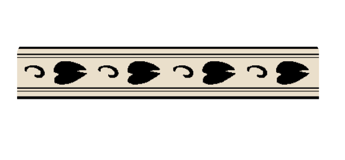
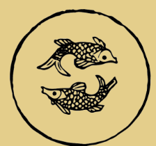
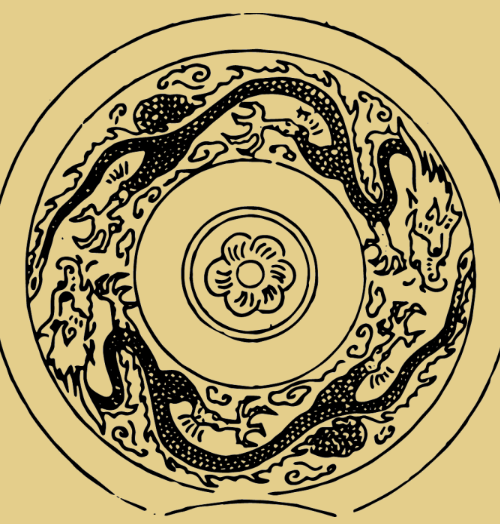
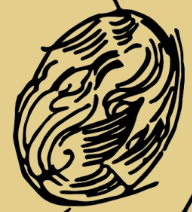
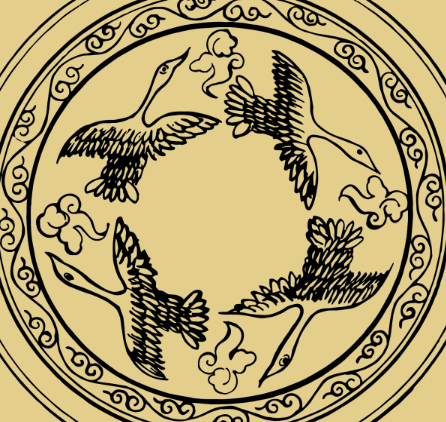





# 元代

<section class="pattern-detail">
    

        
    

    

        

            <h2>龙纹</h2>
            <a class="pattern-detail__fav" href="#">收藏</a>
        


        

            动物纹
            元代
            动物纹
        


        <article class="pattern-detail__info">
            

                <h3>基本信息</h3>
                
素材等级：馆藏纹样

            

            

                
<strong>朝代(时期)</strong>元代

                
<strong>公元纪年</strong>1271年 - 1368年

                
<strong>纹样类别</strong>动物纹

                
<strong>所属器物</strong>陶瓷、织物或建筑构件

                
<strong>载体&工艺</strong>刻划、彩绘、印花或刺绣

                
<strong>材质</strong>土、石、金属、纺织品等

            

            
<strong>图案介绍：</strong>龙纹为元时期常见的动物纹题材之一，常用于器物装饰、建筑彩绘或织绣图案，具有较强的装饰性与时代审美特征。

        </article>

        

            <a class="btn-solid" href="#">查看高清图</a>
            <a class="btn-outline" href="#">下载</a>
            <a class="btn-outline" href="#">加入清单</a>
        

    

</section>

## 纹样次序




### 叶纹 {: .pattern-seq-anchor }

<section class="pattern-detail pattern-detail--seq">    
            
    
        
            <h2>叶纹</h2>            <a class="pattern-detail__fav" href="#">收藏</a>        


        
            植物纹            元代            植物纹        


        <article class="pattern-detail__info">            
                <h3>基本信息</h3>                
素材等级：馆藏纹样
            
            
                
<strong>朝代(时期)</strong>元代
                
<strong>公元纪年</strong>年代未详
                
<strong>纹样类别</strong>植物纹
                
<strong>所属器物</strong>陶瓷、织物或建筑构件
                
<strong>载体&工艺</strong>刻划、彩绘、印花或刺绣
                
<strong>材质</strong>土、石、金属、纺织品等
            
            
<strong>图案介绍：</strong>叶纹为元代时期常见的植物纹题材之一，常用于器物装饰、建筑彩绘或织绣图案。
        </article>

        
            <a class="btn-solid" href="#">查看高清图</a>            <a class="btn-outline" href="#">下载</a>            <a class="btn-outline" href="#">加入清单</a>        
    
</section>


### 双鱼纹 {: .pattern-seq-anchor }

<section class="pattern-detail pattern-detail--seq">    
            
    
        
            <h2>双鱼纹</h2>            <a class="pattern-detail__fav" href="#">收藏</a>        


        
            动物纹            元代            动物纹        


        <article class="pattern-detail__info">            
                <h3>基本信息</h3>                
素材等级：馆藏纹样
            
            
                
<strong>朝代(时期)</strong>元代
                
<strong>公元纪年</strong>年代未详
                
<strong>纹样类别</strong>动物纹
                
<strong>所属器物</strong>陶瓷、织物或建筑构件
                
<strong>载体&工艺</strong>刻划、彩绘、印花或刺绣
                
<strong>材质</strong>土、石、金属、纺织品等
            
            
<strong>图案介绍：</strong>双鱼纹为元代时期常见的动物纹题材之一，常用于器物装饰、建筑彩绘或织绣图案。
        </article>

        
            <a class="btn-solid" href="#">查看高清图</a>            <a class="btn-outline" href="#">下载</a>            <a class="btn-outline" href="#">加入清单</a>        
    
</section>


### 云龙纹 {: .pattern-seq-anchor }

<section class="pattern-detail pattern-detail--seq">    
            
    
        
            <h2>云龙纹</h2>            <a class="pattern-detail__fav" href="#">收藏</a>        


        
            动物纹            元代            动物纹        


        <article class="pattern-detail__info">            
                <h3>基本信息</h3>                
素材等级：馆藏纹样
            
            
                
<strong>朝代(时期)</strong>元代
                
<strong>公元纪年</strong>年代未详
                
<strong>纹样类别</strong>动物纹
                
<strong>所属器物</strong>陶瓷、织物或建筑构件
                
<strong>载体&工艺</strong>刻划、彩绘、印花或刺绣
                
<strong>材质</strong>土、石、金属、纺织品等
            
            
<strong>图案介绍：</strong>云龙纹为元代时期常见的动物纹题材之一，常用于器物装饰、建筑彩绘或织绣图案。
        </article>

        
            <a class="btn-solid" href="#">查看高清图</a>            <a class="btn-outline" href="#">下载</a>            <a class="btn-outline" href="#">加入清单</a>        
    
</section>


### 飞凤纹 {: .pattern-seq-anchor }

<section class="pattern-detail pattern-detail--seq">    
            
    
        
            <h2>飞凤纹</h2>            <a class="pattern-detail__fav" href="#">收藏</a>        


        
            动物纹            元代            动物纹        


        <article class="pattern-detail__info">            
                <h3>基本信息</h3>                
素材等级：馆藏纹样
            
            
                
<strong>朝代(时期)</strong>元代
                
<strong>公元纪年</strong>年代未详
                
<strong>纹样类别</strong>动物纹
                
<strong>所属器物</strong>陶瓷、织物或建筑构件
                
<strong>载体&工艺</strong>刻划、彩绘、印花或刺绣
                
<strong>材质</strong>土、石、金属、纺织品等
            
            
<strong>图案介绍：</strong>飞凤纹为元代时期常见的动物纹题材之一，常用于器物装饰、建筑彩绘或织绣图案。
        </article>

        
            <a class="btn-solid" href="#">查看高清图</a>            <a class="btn-outline" href="#">下载</a>            <a class="btn-outline" href="#">加入清单</a>        
    
</section>


### 云雁纹 {: .pattern-seq-anchor }

<section class="pattern-detail pattern-detail--seq">    
            
    
        
            <h2>云雁纹</h2>            <a class="pattern-detail__fav" href="#">收藏</a>        


        
            动物纹            元代            动物纹        


        <article class="pattern-detail__info">            
                <h3>基本信息</h3>                
素材等级：馆藏纹样
            
            
                
<strong>朝代(时期)</strong>元代
                
<strong>公元纪年</strong>年代未详
                
<strong>纹样类别</strong>动物纹
                
<strong>所属器物</strong>陶瓷、织物或建筑构件
                
<strong>载体&工艺</strong>刻划、彩绘、印花或刺绣
                
<strong>材质</strong>土、石、金属、纺织品等
            
            
<strong>图案介绍：</strong>云雁纹为元代时期常见的动物纹题材之一，常用于器物装饰、建筑彩绘或织绣图案。
        </article>

        
            <a class="btn-solid" href="#">查看高清图</a>            <a class="btn-outline" href="#">下载</a>            <a class="btn-outline" href="#">加入清单</a>        
    
</section>









